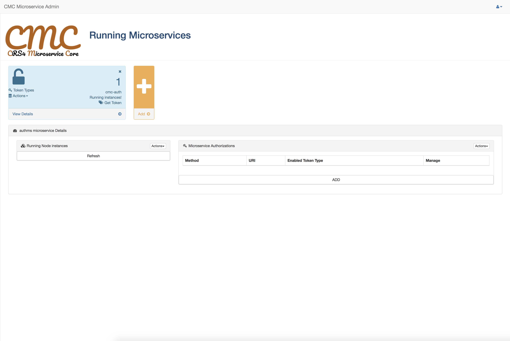

# CMC
## CRS4 Microservice Core - Global project
This repository groups all the projects that compose the CMC framework.
The purpose of this global project is to provide a single entry point to the CMC framework, 
along with a concise documentation (this README) to guide the user through the main concepts behind CMC
and the minimal steps to deploy a fully working environment.

### What does CMC do?
CMC is a general-purpose framework for building services 
that live and communicate in the context of a modular and highly scalable architecture.
It provides cross-cutting functionalities that helps not to reinvent the wheel. They can be grouped as:
- <b>core</b> functionalities, taking care of:
   - authentication ->[cmc-auth](https://github.com/smartenv-crs4/cmc-auth)
   - user management ->[cmc-user](https://github.com/smartenv-crs4/cmc-user)
   - third-party integration ->[cmc-app](https://github.com/smartenv-crs4/cmc-app)
- <b>helper</b> functionalities, taking care of:
   - messaging ->[cmc-mailer](https://github.com/smartenv-crs4/cmc-mailer)
   - file management ->[cmc-upload](https://github.com/smartenv-crs4/cmc-upload)

### The CMC modules
CMC is built around a Microservice architecture. This means that each high level functionality is delivered
through a software piece called Microservice. A microservice is self-contained, runs on its own server, 
is independent from the other microservices but can call them if needed. 
From the code point of view, all services have its own repository as a submodule of <code>cmc</code> repo, 
so to clone the whole framework just type:

<code> git clone https://github.com/smartenv-crs4/cmc.git </code>  
<code> cd cmc </code>  
<code> git submodule update --init --remote </code>   

All done! Now you should have a <code>cmc</code> folder containing a directory for each module.

### Module configuration and run
Now let's see how to properly configure each module in order to have the whole framework up and running.

1. In each module directory, rename the <code>/config/default.json.rename</code> file to <code>/config/default.json</code>
This file contains the properties that configure each service.   
0. <code>cmc-auth</code> must be the first service to be configured. Some properties are mandatory to correctly run that service.
As a rule of thumb, properties which have a placeholder must be set, while others have a default value which should work 
in the majority of environments. In the case of cmc-auth, set the URL of the database (<code>dbHost</code>) and the service itself (<code>authHost</code>).
Note that for each service two profiles can be configured, <b>development</b> and <b>production</b>
<u>In the documentation of each service is explained how to run the service itself, also setting a profile different from the default (production)</u>
0. Start <u>only</u> <code>cmc-auth</code> according to that documentation
0. Point the browser to <code>http://your_base_url:3000/configure</code>,
sign in with the default <code>admin@admin.com/admin</code> email/password, and you will be presented with the following screen: 

0. The "+" button adds a new microservice to the platform. <u>Make sure to do this operation before starting the new service</u>.
Here you must set an arbitrary service name, the URL where the service will be available (directly or through a load balancer/API gateway), 
and the color and icon of the service UI frame
0. Once added, click on the "Get Token" link inside the frame to get the token which has just been generated by the authorisation service.
This token must be set in the <code>auth_token</code> property of <code>default.json</code> before running it
0. Run the new service
0. Repeat steps 5, 6, 7 for each service you want to add to the system.